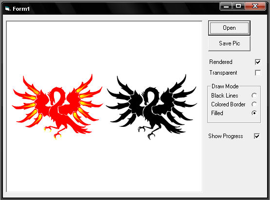



## Vector file preview control

### Description

With this control, you can preview vector files like Adobe Illustrator (*.ai), postscript files (*.eps) or plotter files (*.plt) you can change the view in black wires, colored wires, full color, rendered and/or transparent (require GDI32.dll) you can also save the preview
 
### More Info
 

             |
---                |---
**Submitted On**   |2007-12-17 21:06:30
**By**             |[Christian Coutu](https://github.com/Planet-Source-Code/PSCIndex/blob/master/ByAuthor/christian-coutu.md)
**Level**          |Intermediate
**User Rating**    |5.0 (30 globes from 6 users)
**Compatibility**  |VB 6\.0
**Category**       |[OLE/ COM/ DCOM/ Active\-X](https://github.com/Planet-Source-Code/PSCIndex/blob/master/ByCategory/ole-com-dcom-active-x__1-29.md)
**World**          |[Visual Basic](https://github.com/Planet-Source-Code/PSCIndex/blob/master/ByWorld/visual-basic.md)
**Archive File**   |[Vector\_fil20942212172007\.zip](https://github.com/Planet-Source-Code/christian-coutu-vector-file-preview-control__1-69770/archive/master.zip)

